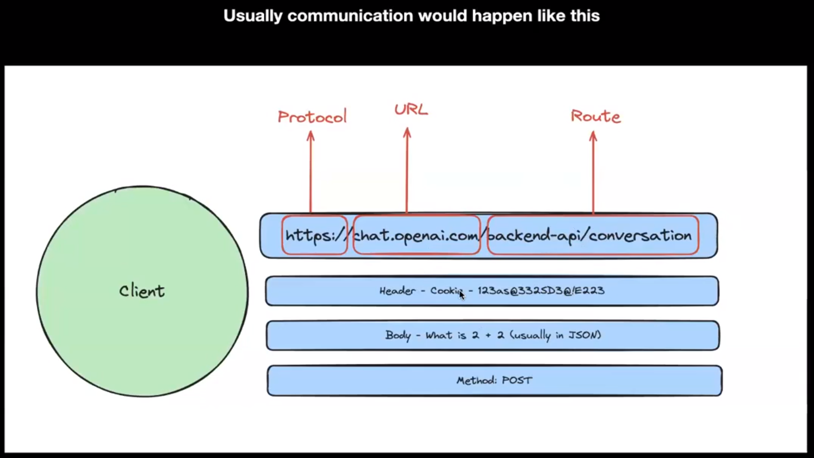

# Node.js and runtime

### ECMAScript
- Scripting language on which JS is based. BAsically specification which tell how JS. 
- It serves as a guide or the rules for scripting language design.

### JS
- JS is a scripting language that conforms to ECMAScript specification.
- Example: Date, var, const, let, function comes from ECMAScript specification
- Beyond JS Example: setTimeout, fs.readFile()-> These are provided as external APIs and are not a part of ECMAScript specifications
  
### Node.js
What can you do with Node.js?
1. Create CLIs
2. Create a video player
3. Create a game
4. Create an HTTP Server

### HTTP
1. A protocol that is defined for machines to communicate
2. Specifically for websites, it is the most common way for your website’s frontend to talk to its backend
### HTTP Protocol
1. Sends a request with some info
2. Server checks and returns back with a response with status code.

### HTTP Client side
These are the things which a client need to take care before sending a request to a HTTP Server
1. Protocol: Example: HTTP, HTTPs
2. Address: URL, IP, PORT
3. Route
4. Header, Body, Query parameters
5. Method

### HTTP Server Side
These are the things which a server needs to think about
1. Response Headers
2. Response Body
3. Status Code

## Backend communication protocols
HTTP (Hypertext Transfer Protocol): This is the foundation of data communication on the World Wide Web. HTTP is a **stateless protocol** used primarily for transmitting documents (such as HTML files), but it's also utilized in *API (Application Programming Interface) services where clients and servers exchange JSON or XML data*.

HTTPS (HTTP Secure): This is essentially **HTTP over TLS/SSL**, adding a layer of security that encrypts the data in transit. HTTPS is crucial for protecting sensitive data and ensuring privacy.

WebSocket: Unlike HTTP, WebSocket provides a **full-duplex communication** channel over a single **TCP connection**. This allows for real-time data exchange between the client and server, making it suitable for live feeds, collaborative applications, and interactive games.

REST (Representational State Transfer): Although not a protocol per se, REST is an architectural style that uses HTTP methods in a stateless manner, emphasizing scalability and simplicity. It's widely used for building APIs that are easy to understand and use.

GraphQL: A query language for APIs, and a runtime for executing those queries by using a type system you define for your data. GraphQL isn't tied to any specific database or storage engine and is instead backed by your existing code and data.

SOAP (Simple Object Access Protocol): A protocol based on XML for accessing web services over HTTP. It's more rigid than REST, requiring specific message formats and usually generating more overhead. However, it provides a higher degree of standardization and built-in error handling.

MQTT (Message Queuing Telemetry Transport): A lightweight messaging protocol designed for low-bandwidth, high-latency, or unreliable networks. It's particularly well-suited for connecting remote devices with a small code footprint or when network bandwidth is at a premium, such as in the Internet of Things (IoT) applications.

AMQP (Advanced Message Queuing Protocol): A protocol that provides robust messaging capabilities for systems that require high performance, reliability, and scalability. It's suitable for complex messaging needs like financial services, telecommunications, and cloud computing.

gRPC: Developed by Google, gRPC is a high-performance, open-source universal RPC (Remote Procedure Call) framework that uses HTTP/2 for transport, Protocol Buffers as the interface description language, and provides features like authentication, load balancing, and more. It's designed for connecting services in a large, distributed system.

## routes, status codes
- 200: Everything OK
- 404: Page not found
- 403: Authentication Issues
- 500: Internal Server Error

